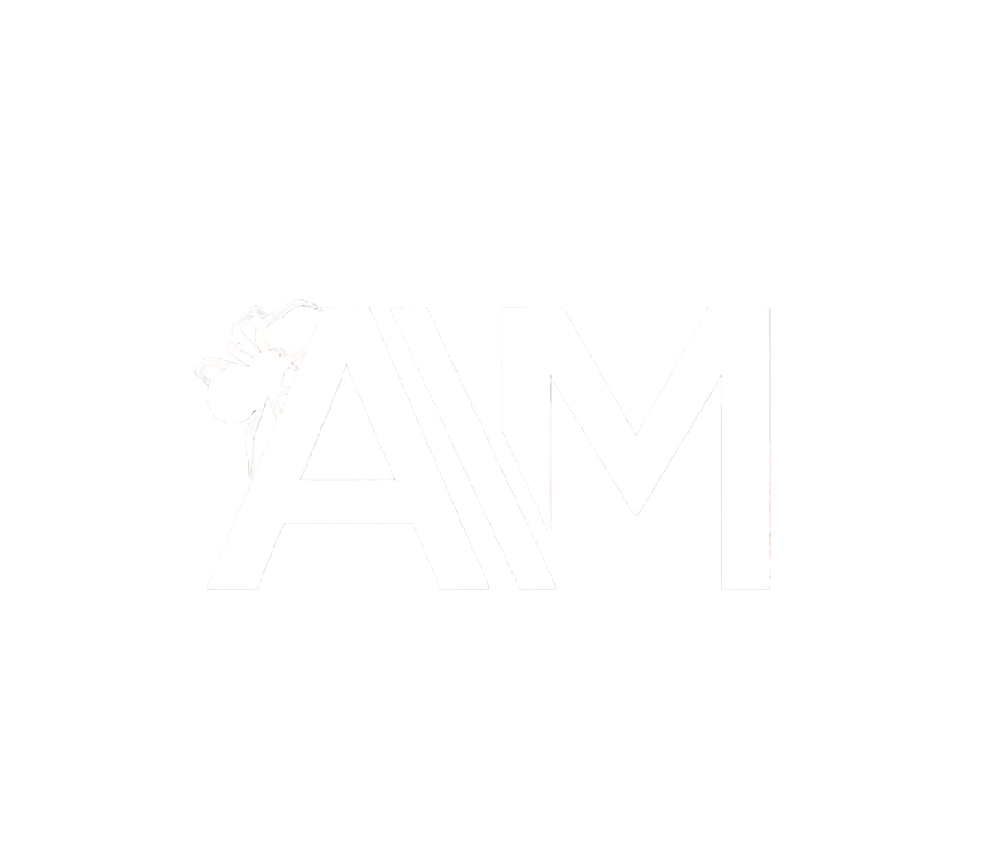
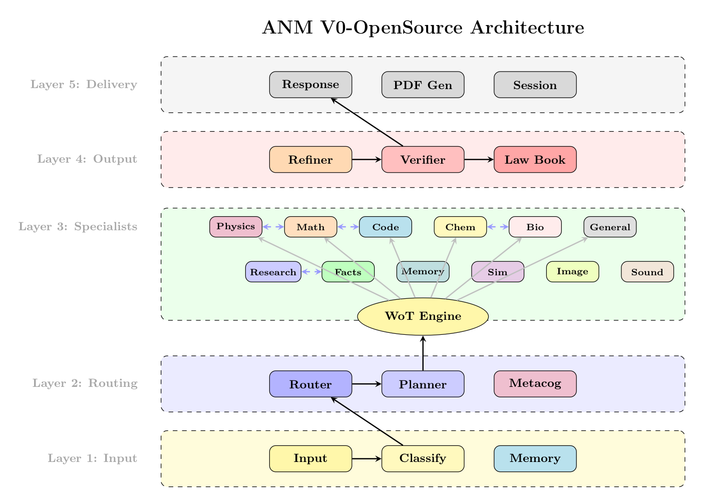

<p align="center">
  
</p>

<h1 align="center">Artificial Neural Mesh (ANM) V0-OpenSource</h1>

<p align="center">
  
  
  
  <a href="https://github.com/ra2157218-boop/Artificial-Neural-Mesh-V0/releases/tag/v0.1.0"></a>
  <a href="https://zenodo.org/records/18112435"></a>
  <a href="https://huggingface.co/datasets/Abd0r/anm-v0-benchmark"></a>
  <a href="https://x.com/SyedAbdurR2hman"></a>
</p>

<p align="center">
  <b>A Multi-Agent AI System with Web-of-Thought Reasoning</b>
</p>

---

## What is ANM?

**Artificial Neural Mesh (ANM)** is an advanced multi-agent AI system that combines 12 specialized domain experts with a novel **Web-of-Thought (WoT)** reasoning engine. Unlike traditional single-model approaches, ANM routes queries through multiple specialists, enabling cross-domain reasoning and producing high-quality, verified outputs.

### Key Features

- **12 Domain Specialists** - Math, Physics, Chemistry, Biology, Code, Research, Memory, Facts, Simulation, Image, Sound, and General
- **Web-of-Thought (WoT)** - Multi-step reasoning that chains specialists together dynamically
- **Research Mode** - Generates academic-style PDF reports with proper citations
- **Diary Memory** - Persistent memory across sessions for context continuity
- **Self-Verification** - Built-in verifier ensures output quality and safety
- **Runs Locally** - Uses quantized models (GGUF) via llama-cpp-python, no API keys required

---

## Quick Start

### Prerequisites

- Python 3.9 - 3.13 (3.13 recommended)
- 8GB+ RAM (16GB recommended for Research Mode)
- ~10GB disk space for models

### Installation

```bash
# Clone the repository
git clone https://github.com/ra2157218-boop/Artificial-Neural-Mesh-V0.git
cd Artificial-Neural-Mesh-V0

# Create virtual environment
python3 -m venv venv
source venv/bin/activate  # On Windows: venv\Scripts\activate

# Install dependencies
pip install -r requirements.txt

# Run ANM
python run.py
```

### First Run

On first run, ANM will automatically download required models from HuggingFace (~3-5GB). This is a one-time process.

```
ANM [Ready]> What is quantum entanglement?
```

---

## Architecture

ANM implements a **five-layer architecture** separating input, routing, specialist execution, output processing, and delivery.

<p align="center">
  
</p>

### Components

| Layer | Component | Description |
|-------|-----------|-------------|
| **Layer 1** | Input, Classify, Memory | Query intake, classification, context retrieval |
| **Layer 2** | Router, Planner, Metacog | Domain detection, execution planning, self-assessment |
| **Layer 3** | 12 Specialists + WoT | Domain experts with Web-of-Thought orchestration |
| **Layer 4** | Refiner, Verifier, Law Book | Output composition, quality validation, constitutional governance |
| **Layer 5** | Response, PDF Gen, Session | Delivery formatting and session management |

---

## Research Mode

Research Mode provides in-depth analysis with academic-style PDF output.

```bash
# Enable Research Mode
python run.py --research
```

### Features

- **Academic PDF Output** - Two-column layout, proper sections
- **Authority Models** - Domain-specific model assignments
- **Web Search** - DuckDuckGo integration for current information
- **Source Citations** - Tracks and cites all sources used
- **Meta-Cognition** - Self-auditing of reasoning quality

### PDF Sections

1. Abstract & Keywords
2. Introduction
3. Methods (Authority Models, WoT Steps)
4. Results (Domain Analysis)
5. Discussion (Meta-Cognition)
6. Limitations
7. Sources
8. Appendix (Technical Details)

---

## Models Used

ANM uses quantized GGUF models for efficient local inference:

| Model | Size | Usage |
|-------|------|-------|
| DeepSeek-R1-Distill-Qwen-1.5B | ~1GB | General reasoning, routing |
| Nanbeige4-3B | ~2GB | Math, Physics, Chemistry, Biology |
| Stable-Code-3B | ~2GB | Code generation |
| Qwen2.5-3B-Instruct | ~2GB | Internet research |

Models are automatically downloaded from HuggingFace on first use.

---

## Benchmark Dataset

> **Official benchmark results and WoT traces are available on HuggingFace. This is the authoritative source for ANM performance metrics.**

<p align="center">
  <a href="https://huggingface.co/datasets/Abd0r/anm-v0-benchmark">
    
  </a>
</p>

The dataset includes:
- **14 benchmark queries** across 9 domains (Math, Physics, Code, Chemistry, Biology, General, Cross-domain, Research, Memory)
- **Complete WoT execution traces** showing how queries are routed through specialists
- **Performance metrics** including latency, verification scores, and domain usage
- **Structured query files** organized by domain for easy analysis

### Load the Dataset

```python
from datasets import load_dataset

# Load benchmark results
dataset = load_dataset("Abd0r/anm-v0-benchmark")

# Or download specific files
from huggingface_hub import hf_hub_download
import json

math_queries = json.load(open(hf_hub_download(
    repo_id="Abd0r/anm-v0-benchmark",
    filename="queries/math.json",
    repo_type="dataset"
)))
```

---

## Configuration

### Environment Variables

```bash
# Memory settings
export ANM_MEMORY_ENABLED=true
export ANM_DIARY_FILE=anm_diary.txt

# Research Mode
export ANM_RESEARCH_MODE=true
export ANM_PDF_OUTPUT=true
```

### Research Mode Config

Located in `anm/config/settings.py`:

```python
RESEARCH_MODE_CONFIG = {
    "authority_models": {...},      # Model assignments per domain
    "workers_per_module": 1,        # Deterministic (no ensemble)
    "wot_min_depth": 3,             # Minimum reasoning steps
    "pdf_output": True,             # Generate PDF
}
```

---

## Project Structure

```
ANM-V0-OpenSource/
├── anm/
│   ├── __init__.py          # Main ANM interface
│   ├── config/              # Configuration settings
│   ├── router/              # Query routing & WoT orchestration
│   ├── specialists/         # 12 domain specialists
│   ├── wot/                 # Web-of-Thought engine
│   ├── memory/              # Diary, working memory, learning
│   ├── refiner/             # Output composition
│   ├── verifier/            # Quality verification
│   ├── output/              # PDF/Markdown generators
│   └── system/              # Inference, model management
├── run.py                   # Main entrypoint
├── requirements.txt         # Dependencies
└── README.md
```

---

## Development

### Tools Used

This project was developed with the assistance of:

- **[Cursor](https://cursor.sh)** - AI-powered code editor
- **[GPT-5.1,GPT-5.2](https://openai.com)** - OpenAI's language model
- **[Claude Code](https://claude.ai)** - Anthropic's Claude for code assistance

### Contributing

1. Fork the repository
2. Create your feature branch (`git checkout -b feature/AmazingFeature`)
3. Commit your changes (`git commit -m 'Add some AmazingFeature'`)
4. Push to the branch (`git push origin feature/AmazingFeature`)
5. Open a Pull Request

---

## Troubleshooting

### Common Issues

**llama-cpp-python installation fails:**
```bash
pip install llama-cpp-python --no-cache-dir
```

**CUDA/Metal support:**
```bash
# For CUDA (NVIDIA)
CMAKE_ARGS="-DLLAMA_CUBLAS=on" pip install llama-cpp-python

# For Metal (Apple Silicon)
CMAKE_ARGS="-DLLAMA_METAL=on" pip install llama-cpp-python
```

**Models not downloading:**
- Check internet connection
- Ensure HuggingFace Hub is accessible
- Try: `huggingface-cli login`

**PDF generation fails:**
- Install reportlab: `pip install reportlab`
- Ensure write permissions in output directory

---

## License

This project is licensed under the MIT License - see the [LICENSE](LICENSE) file for details.

---

## Acknowledgments

- [DeepSeek](https://github.com/deepseek-ai) for R1 reasoning models
- [Qwen](https://github.com/QwenLM) for instruction-tuned models
- [llama.cpp](https://github.com/ggerganov/llama.cpp) for efficient inference
- [HuggingFace](https://huggingface.co) for model hosting

---

<p align="center">
  <b>Built with AI, for AI reasoning</b>
  <br>
  <sub>ANM V0-OpenSource - Multi-Agent Reasoning System</sub>
</p>
